# Kards — Database ER Diagram

29 domain tables (plus `alembic_version`) in PostgreSQL. All PKs are `UUID` (`id`); every table carries `created_at`/`updated_at`; soft-deleted tables expose `deleted_at`.

## Mermaid ER diagram

```mermaid
erDiagram
    users ||--o| volunteer_profiles : "volunteer"
    users ||--o| ngo_profiles : "ngo"
    users ||--o| company_profiles : "company"
    users ||--o{ tokens : "owns"
    users ||--o{ notifications : "receives"
    users ||--o{ api_keys : "owns (company)"
    users ||--o{ audit_logs : "acted"

    users ||--o{ csr_budgets : "company"
    csr_budgets ||--o{ csr_budget_allocations : "has"

    users ||--o{ projects : "company"
    projects ||--o{ project_partnerships : "partners"
    users ||--o{ project_partnerships : "ngo/inviter"
    projects ||--o{ opportunities : "linked"
    users ||--o{ opportunities : "ngo"

    users ||--o{ applications : "volunteer"
    opportunities ||--o{ applications : "receives"
    users ||--o{ work_logs : "volunteer"
    opportunities ||--o{ work_logs : "records"
    applications ||--o| work_logs : "sponsors"

    users ||--o{ certificates : "volunteer/ngo/issuer"
    opportunities ||--o{ certificates : "for"

    users ||--o{ verification_requests : "ngo"
    users ||--o{ csr_scores : "ngo"
    users ||--o{ documents : "uploads"

    users ||--o{ reports : "company/generator"
    projects ||--o{ reports : "scoped"

    users ||--o{ subscriptions : "company"
    plans ||--o{ subscriptions : "plan"
    users ||--o{ invoices : "company"
    subscriptions ||--o{ invoices : "billed"
    users ||--o{ payment_events : ""

    users ||--o{ threads : "creator"
    threads ||--o{ messages : "has"
    threads ||--o{ thread_participants : "members"
    users ||--o{ thread_participants : "joins"
    users ||--o{ messages : "sender"

    users ||--o{ disputes : "filer/against"
    users ||--o{ mail_events : ""
```

## Table catalog

| Table | Purpose | Key FKs |
|---|---|---|
| `users` | Accounts (volunteer / ngo / company / admin), auth, RBAC role, locale | — |
| `tokens` | Refresh (rotating family) + email-verify + password-reset tokens | users |
| `volunteer_profiles` | Volunteer skills, location, availability | users |
| `ngo_profiles` | NGO org data + verification status | users |
| `company_profiles` | Company data (CIN, industry) | users |
| `documents` | Uploaded files (verification, evidence, receipts, attendance, attachments) | users |
| `verification_requests` | NGO verification queue | users |
| `csr_scores` | CSR-Ready Score breakdowns (documents/operations/performance/governance) | users |
| `csr_budgets` | Annual CSR budget per company | users |
| `csr_budget_allocations` | Schedule VII category allocations within a budget | csr_budgets |
| `projects` | Company CSR projects | users |
| `project_partnerships` | Company ⇄ NGO partnership invites on projects | projects, users |
| `opportunities` | Volunteering opportunities published by NGOs | users, projects |
| `applications` | Volunteer applications to opportunities | opportunities, users |
| `work_logs` | Volunteer hours logged (pending/approved/rejected) | opportunities, users, applications |
| `certificates` | Verified certificates (tamper hash, public code) | users, opportunities |
| `reports` | Async CSR compliance/project reports (queued→ready PDF) | users, projects |
| `plans` | Billing plan catalog (seeded) | — |
| `subscriptions` | Company subscriptions (trial/active/…) | users, plans |
| `invoices` | Success-fee / plan invoices | users, subscriptions |
| `payment_events` | Idempotent gateway webhook log | — |
| `threads` | Subject-scoped message threads | users |
| `messages` | Thread messages (+ attachment key) | threads, users |
| `thread_participants` | Thread membership + last-read | threads, users |
| `disputes` | Disputes on certificates/work-logs/opportunities | users |
| `notifications` | In-app notifications | users |
| `api_keys` | White-label API keys for companies (hashed secrets) | users |
| `audit_logs` | Immutable audit trail (actor, action, subject, IP, UA) | users |
| `mail_events` | Outbound email log (console/SMTP transport) | — |

## Notable constraints

- `applications (opportunity_id, volunteer_id)` unique — one application per volunteer per opportunity.
- `work_logs (opportunity_id, volunteer_id, log_date)` unique — one hours-log per volunteer per opportunity per day.
- `certificates.code` unique — public verification handle.
- `csr_budgets (company_user_id, fiscal_year)` unique — one budget per fiscal year.
- `csr_budget_allocations (budget_id, category)` unique.
- `project_partnerships (project_id, ngo_user_id)` unique.
- `threads (subject, subject_id)` unique — single thread per subject.
- `thread_participants (thread_id, user_id)` unique.
- `payment_events (provider, event_id)` unique + `invoices (provider, provider_invoice_id)` unique — idempotent billing.
- Soft-delete (`deleted_at`) on: `users`, `ngo_profiles`, `company_profiles`, `csr_budgets`, `projects`, `opportunities`.
